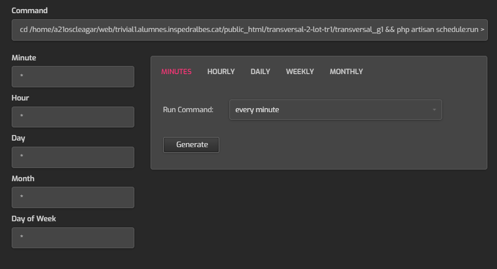

# transversals
Esquema mínim de carpetes pels projectes transversals

És obligatori seguir aquesta estructura tot i que la podeu ampliar.

## Atenció
Un cop comenceu heu de canviar aquesta explicació amb la corresponent al vostre projecte (utilitzant markdown)

# Aquest fitxer ha de contenir com a mínim:
 * Nom dels integrants
 * Nom del projecte
 * Petita descripció
 * <a href="https://design.penpot.app/#/view/39eb6d3d-9932-80bd-8001-aacd5aad7481?page-id=39eb6d3d-9932-80bd-8001-aacd5aad7482&section=interactions&index=0&share-id=60409f81-bb57-80cc-8001-abdc76c5db0f">Adreça del prototip del Penpot</a>
 * URL de producció (quan la tingueu)
 * Estat: (explicació de en quin punt està)

# Tutorial de CRON

Com hem de desplegar aquesta aplicació en un hosting, hem de fer un CRON que envii les partides diaries, per a fer aixo hem d'entrar a la pagina del hosting, en el nostre cas labs.inspedralbes.cat:8083.

Haurem d'iniciar sessió en el compte on tinguem el projecte desplegat, i anar a CRON, quan entrem a CRON li donem a Add Job

