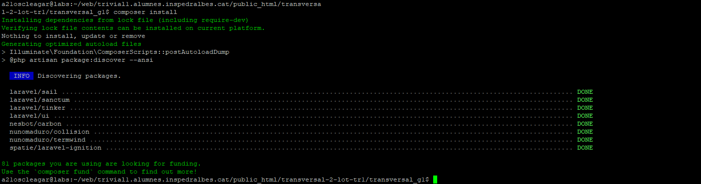
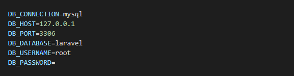

# transversals
Esquema mínim de carpetes pels projectes transversals

És obligatori seguir aquesta estructura tot i que la podeu ampliar.

## Atenció
Un cop comenceu heu de canviar aquesta explicació amb la corresponent al vostre projecte (utilitzant markdown)

# Aquest fitxer ha de contenir com a mínim:
 * Nom dels integrants
 * Nom del projecte
 * Petita descripció
 * <a href="https://design.penpot.app/#/view/39eb6d3d-9932-80bd-8001-aacd5aad7481?page-id=39eb6d3d-9932-80bd-8001-aacd5aad7482&section=interactions&index=0&share-id=60409f81-bb57-80cc-8001-abdc76c5db0f">Adreça del prototip del Penpot</a>
 * URL de producció (quan la tingueu)
 * Estat: (explicació de en quin punt està)

# Tutorial de CRON

Com hem de desplegar aquesta aplicació en un hosting, hem de fer un CRON que envii les partides diaries, per a fer aixo hem d'entrar a la pagina del hosting, en el nostre cas labs.inspedralbes.cat:8083.

Haurem d'iniciar sessió en el compte on tinguem el projecte desplegat, i anar a CRON, quan entrem a CRON li donem a Add Job

# Usuaris per defecte

Usuari: Ausias
Email: ausias@ausias.cat
password: ausiasausias01

Usuari: Pedra
Email: pedra@pedra.cat
password: pedrapedra01

# Swagger: 

# Documentacio Desplegament:

Primer Haurem de tenir un domini on poder fer un git clone del projecte (en el nostre cas tenim el servidor del labs).

Ens haurem de connectar amb al Putty al servidor i entrar a la carpeta del domini on pujem a producció.

Dins d'aquesta carpeta haurem de fer un git clone, i amb aixo tots els fitxers del projecte es pujaran dins la carpeta.

Una vegada el projecte estigui clonat, hem de fer dins de la carpeta transversal_g1 un composer install. Aixo el que fara, sera instalar totes les dependencies i carpetes de laravel per a que el projecte carregui.

Haurem de agafar el .env.example, ja que el .env no es clona, i haurem de canviar els respectius per la base de dades que tu vulguis utilitzar.

Quan tinguem fet tot aixo, farem un php artisan migrate, i ja tindrem el projecte muntat
